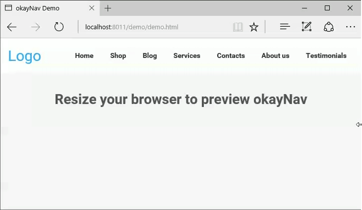

#okayNav jQuery Plugin
You know how navigations have only a desktop and a mobile state, right? I thought, "this might cost people money because it requires additional click for users to reach even the most important pages."

This navigation aims at progressively collapsing navigation links into an off-screen navigation instead of doing it for all the links at the same time. Check out this example:



Or play with it on [CodePen](http://codepen.io/VPenkov/pen/wMZBOg).

## How to Use
This is the code used in the example:
```html
<header id="header">
    <a class="site-logo" href="#">
       Logo
    </a>
    
    <nav role="navigation" id="nav-main" class="okayNav">
        <ul>
            <li><a href="#">Home</a></li>
            <li><a href="#">Shop</a></li>
            <li><a href="#">Blog</a></li>
            <li><a href="#">Services</a></li>
            <li><a href="#">Contacts</a></li>
            <li><a href="#">About us</a></li>
            <li><a href="#">Testimonials</a></li>
        </ul>
    </nav>
</header><!-- /header -->
```
Include the CSS:
```html
<link rel="stylesheet" href="css/okayNav.css" media="screen">
```
Include the library:
```html
<script src="js/jquery.okayNav.min.js"></script>
```

And here's the JS to initialize it:
```javascript
var navigation = $('#nav-main').okayNav();
```

## Dependencies
okayNav depends on jQuery. Tested with jQuery 1.10+ but should work with lower versions.
The stylization of okayNav comes in a commented LESS and CSS.

## Browser Support
okayNav supports IE9+, Firefox, Chrome. Transitions work in IE10+.

## Default options
```javascript
var navigation = $('#nav-main').okayNav({
	parent : '', // will call nav's parent() by default
    toggle_icon_class : 'okayNav__menu-toggle',
    toggle_icon_content: '<span /><span /><span />',
    beforeopen : function() {}, // Will trigger before the nav gets opened
    open : function() {}, // Will trigger after the nav gets opened
    beforeclose : function() {}, // Will trigger before the nav gets closed
    close : function() {}, // Will trigger after the nav gets closed
});
```

## Methods
Get the nav's parent element: ``navigation.okayNav('getParent');``

Get the nav's visible part: ``navigation.okayNav('getVisibleNav');``

Get the nav's off-screen part: ``navigation.okayNav('getInvisibleNav');``

Get the nav's toggle icon: ``navigation.okayNav('getNavToggleIcon');``

Open the off-screen part: ``navigation.okayNav('openInvisibleNav');``

Close the off-screen part``navigation.okayNav('closeInvisibleNav');``

Toggle the off-screen part``navigation.okayNav('toggleInvisibleNav');``

Get the nav children's total width: ``navigation.okayNav('getChildrenWidth');``

Recalculate what should be visible and what shouldn't: ``navigation.okayNav('recalcNav');``

Destroy the nav, make everything visible, disable all events: ``navigation.okayNav('destroy');``

## Roadmap
The following features will be implemented at the next versions:
- Swipe gestures
- A callback when a nav item is collapsed/expanded
- AMD support

Pull requests are appreciated.

## License
Licensed under the [MIT License](https://opensource.org/licenses/MIT).

## Support
Please use the GitHub issues for support requests. If you need someone to implement okayNav for you, hit me up at [vergil@moongrab.com](vergil@moongrab.com).

## Changelog
**1.0.2**
Resize events are now a lot more efficient

**1.0.1**
First public version

## Tell me what you've created
Ping me on [Facebook](http://fb.com/vergil.penkov) or [Twitter](http://twitter.com/vergilpenkov). I'd definitely love to see what you've done with okayNav!

## Buy me a beer
I appreciate good beer and good coffee. If you find this plugin useful and want to say thanks, there's no better way to do it. My PayPal is [vergil@moongrab.com](vergil@moongrab.com).